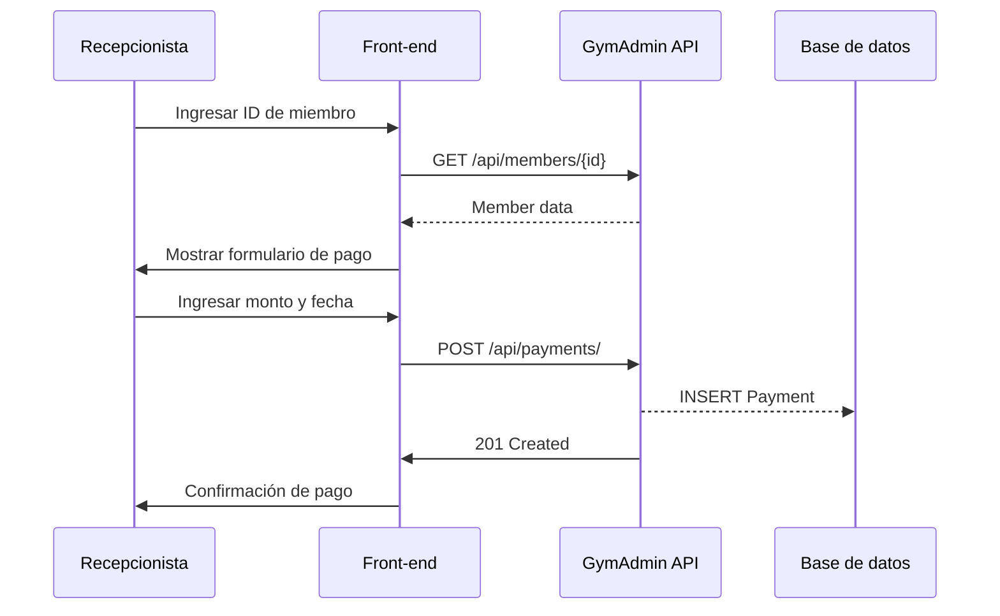
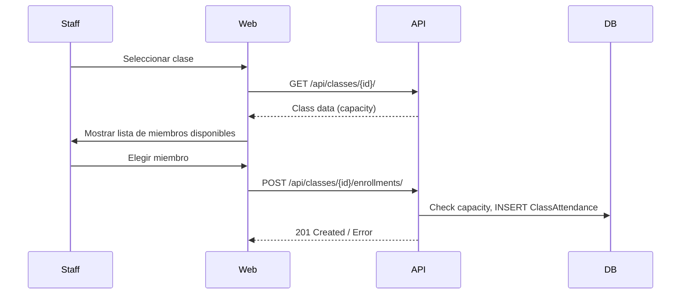

# GymAdmin – Especificaciones de Negocio  
*(Spec – version 1.0 – 20‑Abr‑2026)*  

---

## 1. Visión General

GymAdmin es una aplicación web basada en **Django** que permite a los administradores de un gimnasio gestionar:

- **Miembros**  
- **Clases y horarios**  
- **Pagos**  
- **Acceso de usuarios** (personal del gimnasio)  

La plataforma combina una interfaz de *admin* (HTML/CSS) y una **API REST** (Django‑Rest‑Framework) para permitir integraciones móviles o de terceros.

---

## 2. Actores

| Actor | Rol | Responsabilidades |
|-------|-----|-------------------|
| **Administrador** | `admin` | Gestionar miembros, clases, pagos; crear y asignar roles; supervisar la plataforma. |
| **Instructor** | `instructor` | Ver lista de miembros, inscribirlos en sus clases; marcar asistencia. |
| **Recepcionista** | `staff` | Registrar pagos, inscribir miembros en clases, actualizar datos de miembros. |
| **Miembro** | `member` | Consultar su propio historial (clases, pagos). |
| **Sistema Externo** | `external_app` | Consumir la API para sincronizar datos con aplicaciones móviles. |

---

## 3. Requisitos Funcionales

| ID | Requisito | Actor | Descripción | Prioridad |
|----|-----------|-------|-------------|-----------|
| RF001 | **Gestión de miembros** | admin, staff | CRUD completo de miembros: crear, leer, actualizar, borrar. | Alta |
| RF002 | **Membresía y renovación** | admin, staff | Registrar tipo de membresía (mensual, anual, clase única) y fechas de inicio/fin. | Alta |
| RF003 | **Clases y horarios** | instructor, staff | Programar clases, asignar instructor, gestionar capacidad. | Alta |
| RF004 | **Inscripción a clases** | staff, instructor | Inscribir miembros en clases; validar capacidad. | Media |
| RF005 | **Pagos** | staff, member | Registrar pagos, marcar como pagado/pendiente/vencido. | Alta |
| RF006 | **Reportes** | admin | Generar reportes de ingresos, membresías activas, asistencia. | Media |
| RF007 | **Autenticación** | Todos | Login/Logout, recuperación de contraseña. | Alta |
| RF008 | **Roles y permisos** | admin | Asignar roles a usuarios y restringir acceso según rol. | Alta |
| RF009 | **API REST** | external_app | Endpoints para miembros, clases, pagos. | Media |
| RF010 | **Notificaciones** | staff, member | Enviar email al vencimiento de pago. | Baja |

---

## 4. Requisitos No Funcionales

| ID | Requisito | Descripción |
|----|-----------|-------------|
| RNF001 | **Seguridad** | Autenticación JWT, cifrado de contraseñas (`argon2`), CSRF protection. |
| RNF002 | **Escalabilidad** | Soportar 10 000 miembros y 1 000 clases semanales sin degradar la respuesta. |
| RNF003 | **Disponibilidad** | 99.9 % uptime, con failover en base de datos (replicación). |
| RNF004 | **Usabilidad** | Interfaz responsive, accesible (WCAG 2.1 AA). |
| RNF005 | **Performance** | Tiempo de respuesta < 200 ms para llamadas API. |
| RNF006 | **Mantenibilidad** | Código modular, pruebas unitarias (≥ 70 % coverage). |
| RNF007 | **Registros** | Log de auditoría de cambios de datos sensibles. |

---

## 5. Casos de Uso (User Stories)

| ID | Historia | Acceptance Criteria |
|----|----------|---------------------|
| US001 | Como **Administrador** quiero crear un nuevo miembro, para que pueda inscribirse en clases. | - Se muestra formulario válido.<br>- Se guardan todos los campos requeridos.<br>- Se envía notificación de creación. |
| US002 | Como **Instructor** quiero ver la lista de miembros inscritos en mi clase. | - Se muestra tabla filtrada por la clase.<br>- Se indica asistencia pendiente. |
| US003 | Como **Recepcionista** quiero registrar un pago, para marcar la membresía como activa. | - Se selecciona miembro.<br>- Se ingresa monto y fecha.<br>- Se actualiza estado a “Pagado”. |
| US004 | Como **Miembro** quiero consultar mi historial de pagos. | - Se listan pagos con estado y fecha.<br>- Se permite descargar PDF del historial. |
| US005 | Como **Sistema Externo** quiero obtener la lista de miembros activos mediante la API. | - GET `/api/members/?active=true` devuelve JSON con paginación. |
| US006 | Como **Administrador** quiero eliminar un miembro que ya no paga. | - Se muestra confirmación.<br>- Se elimina registro y se archiva historial. |
| US007 | Como **Staff** quiero inscribir a un miembro en una clase que ya no tiene espacio. | - Se muestra mensaje de error “Capacidad excedida”. |

---

## 6. Modelo de Datos Simplificado

```text
Member
------
id PK
first_name
last_name
dob
email
phone
membership_type FK
start_date
end_date
active BOOL

MembershipType
--------------
id PK
name (e.g., Mensual, Anual, Clase Única)
price
duration_days

ClassSchedule
-------------
id PK
name
instructor FK
start_time
end_time
capacity
members M2M (through ClassAttendance)

ClassAttendance
---------------
id PK
member FK
class_schedule FK
status (ENROLLED, PRESENT, ABSENT)

Payment
-------
id PK
member FK
amount
paid_at
status (PAID, PENDING, OVERDUE)
```

---

## 7. Especificaciones de la API REST

| Endpoint | Método | Parámetros | Respuesta | Descripción |
|----------|--------|------------|-----------|-------------|
| `/api/members/` | GET | `?active=true&page=1&size=25` | Listado paginado de miembros | Obtiene miembros filtrados por estado activo. |
| `/api/members/` | POST | JSON: `{first_name, last_name, email, membership_type, start_date, ...}` | `201 Created` | Crea un nuevo miembro. |
| `/api/members/{id}/` | GET | N/A | Objeto miembro | Detalle completo del miembro. |
| `/api/members/{id}/` | PUT | JSON con campos actualizables | `200 OK` | Actualiza información del miembro. |
| `/api/members/{id}/` | DELETE | N/A | `204 No Content` | Elimina el miembro. |
| `/api/classes/` | GET | `?instructor_id=5` | Listado de clases | Filtra por instructor. |
| `/api/classes/` | POST | JSON: `{name, instructor, start_time, end_time, capacity}` | `201 Created` | Programa una clase. |
| `/api/payments/` | POST | JSON: `{member_id, amount, status}` | `201 Created` | Registra un pago. |
| `/api/payments/{id}/` | PATCH | JSON: `{status="PAID"}` | `200 OK` | Actualiza estado de pago. |

**Autenticación**  
- Todos los endpoints requieren un header `Authorization: Bearer <token>` (JWT).  
- Permisos por rol están definidos en los serializers (`IsAdminUser`, `IsInstructor`, etc.).

---

## 8. Flujo de Trabajo (Diagramas de Secuencia)

### 8.1 Registro de Pago



### 8.2 Inscripción a Clase



---

## 9. Reglas de Negocio Clave

| Regla | Descripción |
|-------|-------------|
| **RN001** | Una membresía se considera **activa** si `active=True` y la fecha actual está entre `start_date` y `end_date`. |
| **RN002** | El pago de un miembro se marca como `OVERDUE` automáticamente cuando la fecha de `paid_at` + `duration_days` es > hoy y `status != PAID`. |
| **RN003** | La inscripción a una clase sólo se permite si `ClassSchedule.members.count() < capacity`. |
| **RN004** | Cuando se elimina un miembro, su historial (payments, attendances) se conserva en tablas de auditoría y se marca `archived=True`. |
| **RN005** | Los `Payment.status` se actualizan automáticamente a `PAID` cuando se registra un pago; `PENDING` al crear la membresía; `OVERDUE` cuando el pago se pasa de fecha. |

---

## 10. Métricas de Éxito

| Métrica | Meta | Comentario |
|---------|------|-------------|
| 1. **Tasa de renovación** | > 90 % de miembros renuevan antes de `end_date`. | Indicador de retención. |
| 2. **Cobertura de pruebas** | ≥ 70 % | Asegura calidad del código. |
| 3. **Velocidad de respuesta API** | < 200 ms (p95) | Garantiza experiencia móvil. |
| 4. **Satisfacción del usuario** | Índice de CSAT > 4.5/5 | Medido vía encuesta interna. |

---

## 11. Dependencias y Tecnologías

| Categoría | Tecnología | Versión | Comentario |
|-----------|------------|---------|------------|
| Web Framework | Django | 4.2 | Core de la aplicación. |
| API | Django‑Rest‑Framework | 3.14 | Documentación Swagger con `drf-yasg`. |
| Auth | SimpleJWT + Argon2 | 4.4 | Token‑based security. |
| Front‑end | Bootstrap 5 + jQuery | 5.x | UI responsive. |
| DB | PostgreSQL | 15 | Con replication y índices adecuados. |
| Testing | Pytest + Django Test Client | - | Coverage ≥ 70 %. |
| CI/CD | GitHub Actions | - | Automatiza lint, tests, build. |

---

## 12. Entregables

| Entregable | Responsable | Dueño | Descripción |
|------------|-------------|-------|-------------|
| **Especificaciones de Negocio (this file)** | Product Owner | Admin | Documenta todo el flujo de negocio. |
| **Modelos de datos** | Equipo de Data | Data Architect | Diagrama entidad‑relación. |
| **API Swagger/OpenAPI** | Equipo de Backend | Backend Lead | Archivo `openapi.yaml`. |
| **Pruebas Unitarias** | Equipo QA | QA Lead | `coverage.html`. |
| **Documentación UI** | Equipo Front‑end | Front‑end Lead | Guía de componentes. |

---

## 14. Módulo de Métricas del Gimnasio

Dashboard de métricas globales accesible desde la pestaña **Métricas** en el sidebar.
Permite seleccionar un rango de fechas y visualizar el comportamiento del gimnasio en ese período.

### Métricas implementadas

| ID    | Métrica                         | Descripción |
|-------|---------------------------------|-------------|
| MG001 | Clientes registrados en período | Cantidad de clientes dados de alta en el rango de fechas seleccionado. |
| MG002 | Visitantes únicos               | Cantidad de clientes distintos que ingresaron al gimnasio en el período. |
| MG003 | Ingresos por cliente            | Ranking de clientes ordenados por cantidad de ingresos en el período, con gráfico de barras y tabla detallada. |

### TODO — Métricas pendientes de implementación

| ID    | Métrica       | Descripción                                                                                   | Estado   |
|-------|---------------|-----------------------------------------------------------------------------------------------|----------|
| MG004 | Horarios pico | Distribución de check-ins por hora del día para identificar en qué horario hay mayor afluencia al gimnasio. | ⏳ TODO |

### Endpoint

`GET /api/v1/gym-metrics?startDate=YYYY-MM-DD&endDate=YYYY-MM-DD`

Requiere: rol con permiso `reports: read` (admin, supervisor, profesor, recepcionista).

Respuesta:
```json
{
  "period":            { "startDate": "2026-05-01", "endDate": "2026-05-31" },
  "clientsRegistered": 15,
  "uniqueVisitors":    42,
  "totalCheckIns":     180,
  "checkInsPerClient": [
    { "clientId": "...", "clientName": "Juan López", "total": 12 }
  ]
}
```

### Permisos

El módulo usa el permiso `reports` (ya definido en `packages/shared/src/permissions.js`):
- `admin` / `supervisor`: acceso completo
- `profesor` / `recepcionista`: solo lectura

---

## 13. Aprobaciones

| Rol | Firma | Fecha |
|-----|-------|-------|
| Product Owner | **[Nombre]** | 20‑Abr‑2026 |
| Arquitecto de Software | **[Nombre]** | 20‑Abr‑2026 |
| Líder de QA | **[Nombre]** | 20‑Abr‑2026 |

--- 